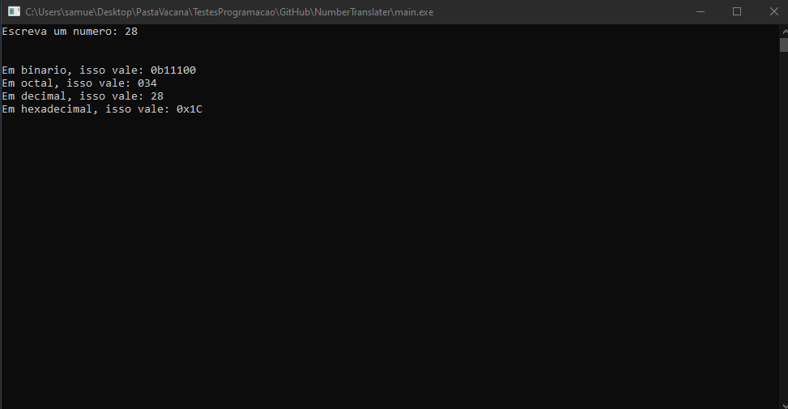

# Number Translater

Um projeto C++ para traduzir números para outros tipos primitivos. O Number Translater trabalha com números:
- Binários (base 2)
- Decimais (base 10)
- Octais (base 8)
- Hexadecimais (base 16)


*04/11/2020*

## Compilando o programa :gear:

O arquivo (*make.bat*)[make.bat] serve para rodar o programa. Para usa-lo, basta somente abrir um terminal na raiz do projeto, e digitar ```make <parametro>```.

Existem dois **parâmetros**:

- d: Parâmetro para depurar (debug). Irá compilar o programa e salvar o arquivo em (*bin/debug*)[bin/debug]
- c: Parâmetro para compilar (compile). Irá compilar o programa e salvar o arquivo na raiz do projeto (usar quando uma versão do programa estiver completo)

## Licença :pencil:

Esse projeto está mantido sobre uma (licença MIT)[LICENSE].
